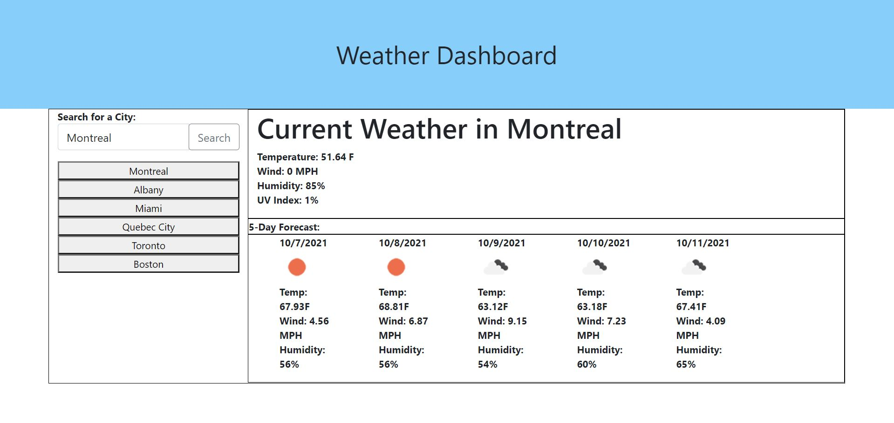

# Homework6-WeatherDashboard
Homework 6: Weather Dashboard. Server Side APIs week.
Description: This web app allows users to search and view current and 5 day forecasted weather for over 200,000 cities around the world. Previously searched locations are saved to the local storage and are saved as buttons in the web application UI. This Open Weather App API is used as the source for the weather data.

Finished App Screenshot: 

Finished App URL: https://calvinswomley.github.io/Homework6-WeatherDashboard/

Contact: Calvin Swomley | calvinswomley@gmail.com

Copyright (c) 2021-2026 Calvin Swomley and others

Permission is hereby granted, free of charge, to any person obtaining
a copy of this software and associated documentation files (the
"Software"), to deal in the Software without restriction, including
without limitation the rights to use, copy, modify, merge, publish,
distribute, sublicense, and/or sell copies of the Software, and to
permit persons to whom the Software is furnished to do so, subject to
the following conditions:

The above copyright notice and this permission notice shall be
included in all copies or substantial portions of the Software.

THE SOFTWARE IS PROVIDED "AS IS", WITHOUT WARRANTY OF ANY KIND,
EXPRESS OR IMPLIED, INCLUDING BUT NOT LIMITED TO THE WARRANTIES OF
MERCHANTABILITY, FITNESS FOR A PARTICULAR PURPOSE AND
NONINFRINGEMENT. IN NO EVENT SHALL THE AUTHORS OR COPYRIGHT HOLDERS BE
LIABLE FOR ANY CLAIM, DAMAGES OR OTHER LIABILITY, WHETHER IN AN ACTION
OF CONTRACT, TORT OR OTHERWISE, ARISING FROM, OUT OF OR IN CONNECTION
WITH THE SOFTWARE OR THE USE OR OTHER DEALINGS IN THE SOFTWARE.
